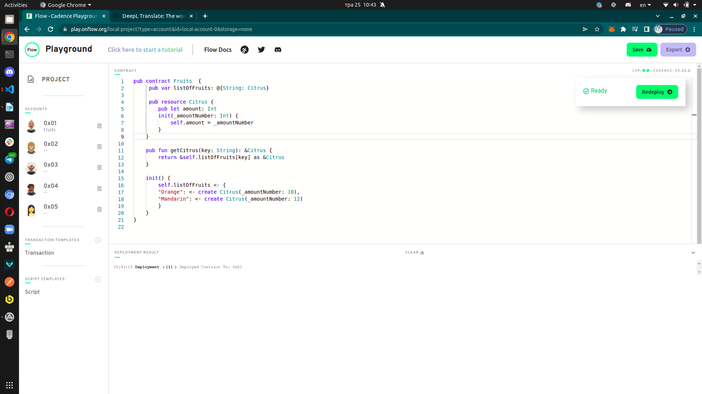
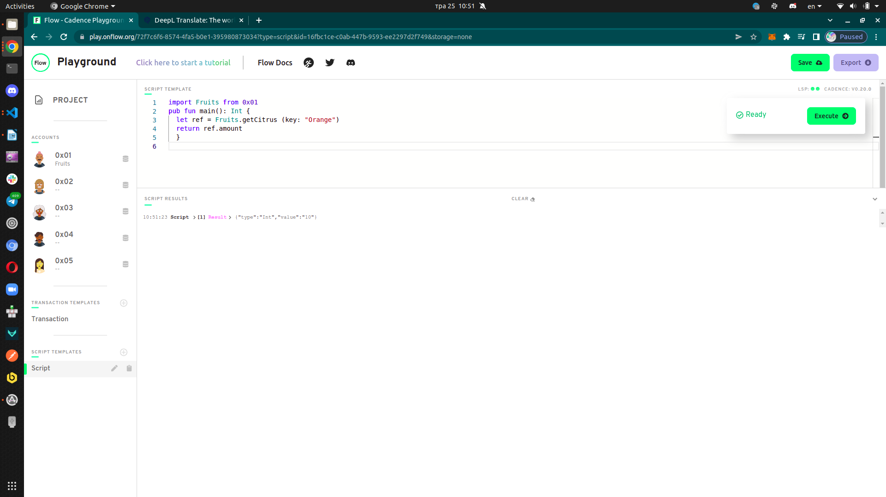

## Table of Contents
- [Chapter 3 Day 1](#Chapter-3-Day-1)
- [Chapter 3 Day 2](#Chapter-3-Day-2)
- [Chapter 3 Day 3](#Chapter-3-Day-3)
- [Chapter 3 Day 4](#Chapter-3-Day-4)
- [Chapter 3 Day 5](#Chapter-3-Day-5)

## Chapter 3 Day 1
Quests
1. In words, list 3 reasons why structs are different from resources.
2. Describe a situation where a resource might be better to use than a struct.
3. What is the keyword to make a new resource?
4. Can a resource be created in a script or transaction (assuming there isn't a public function to create one)?
5. What is the type of the resource below?
6. Let's play the "I Spy" game from when we were kids. I Spy 4 things wrong with this code. Please fix them.

Answer
1. Struct can be declared out of contract. Struct can be easily loosed or overwritten. Struct possible to copy. 
2. Secure creation and activities with NFT.
3. Create
4. Resurce can be created only in contract. 
5. That is resource
```bash
pub contract Test {

    // Hint: There's nothing wrong here ;)
    pub resource Jacob {
        pub let rocks: Bool
        init() {
            self.rocks = true
        }
    }

    pub fun createJacob(): @Jacob { // @Jacob
        let myJacob <- @Jacob() // 1) <- ; 2) @Jacob 
        return <- myJacob // <- 
    }
}

```
<br>


## Chapter 3 Day 2
Quests
1. Write your own smart contract that contains two state variables: an array of resources, and a dictionary of resources. Add functions to remove and add to each of them. They must be different from the examples above.


Answer
1. 
Dictionary Contract <br>

```bash
pub contract Fruits  {

    // dictionary 
    pub var listOfFruits: @{String: Citrus}

    pub resource Citrus {
        pub let message: String
        init() {
            self.message = "Orange"
        }
    }

    // add to dictionary
    pub fun addCitrus(citrus: @Citrus) {
       // let key = citrus.message
       // self.listOfFruits[key] <-! citrus
       // or 
        
        let key = citrus.message
        let oldList <- self.listOfFruits[key] <- citrus
        destroy oldList
    }
    
    //remove from dictionary 
    pub fun removeGreeting(key: String): @Citrus {
        let citrus <- self.listOfFruits.remove(key: key) ?? panic("No Citrus")
        return <- citrus
    }

    init() {
        self.listOfFruits <- {}
    }
}
```
Array Contract <br>
 
```bash
pub contract color {

// array 

    pub var rainbows: @[Color]

    pub resource Color {
        pub let message: String
        init() {
            self.message = "Green"
        }
    }

    pub fun addColor(color: @Color) {
        self.rainbows.append(<- color)
    }

    pub fun removeGreeting(index: Int): @Color {
        return <- self.rainbows.remove(at: index)
    }

    init() {
        self.rainbows <- []
    }

}
```

## Chapter 3 Day 3
Quests
1. Define your own contract that stores a dictionary of resources. Add a function to get a reference to one of the resources in the dictionary.
2. Create a script that reads information from that resource using the reference from the function you defined in part 1.
3. Explain, in your own words, why references can be useful in Cadence.

Answer
1. Reference

2. Script

3. It is easiest way work with resources. So you don`t need move them and know where they are located.


## Chapter 3 Day 4
Quests
1. Explain, in your own words, the 2 things resource interfaces can be used for (we went over both in today's content)
2. Define your own contract. Make your own resource interface and a resource that implements the interface. Create 2 functions. In the 1st function, show an example of not restricting the type of the resource and accessing its content. In the 2nd function, show an example of restricting the type of the resource and NOT being able to access its content.
3. How would we fix this code?

Answer
1. Interfaces can be used for resources and structs. Behavior will be the same. 
The main things of resources that it is set up requirements for resource or struct and these requirements should be  implemented to. Implementation of resources should include all function and variables. Developer can create resource, but this activity of  it will be managed by interfaces.
2. Test contract 
```bash
pub contract test {

    pub resource interface IFruits {
      pub var cost: Int
     
    }

    pub resource Fruits: IFruits {
      pub var cost: Int
      pub var name: String

      pub fun setItem(name: String): String {
        self.name = name
        return self.name
      }

      init() {
        self.cost = 1
        self.name = "Orange"
      }
    }

    pub fun outOfRestriction() {
      let Citrus: @Fruits <- create Fruits()
      Citrus.setItem(name: "Gray Orange")
      log(Citrus.name)

      destroy Citrus
    }

    pub fun containRestrictions() {
      let Kiwi: @Fruits{IFruits} <- create Fruits()
      let newItem = Kiwi.setItem(name: "green kiwi") // this si not working 
      log(newItem)

      destroy Kiwi
    }
}
```
3. Fixed code 

```bash
pub contract Stuff {

    pub struct interface ITest {
      pub var greeting: String
      pub var favouriteFruit: String
      pub fun changeGreeting(newGreeting: String): String
    }
    pub struct Test: ITest {
      pub var greeting: String
      pub var favouriteFruit: String

      pub fun changeGreeting(newGreeting: String): String {
        self.greeting = newGreeting
        return self.greeting 
      }

      init() {
        self.greeting = "Hello!"
        self.favouriteFruit = "Orange"
      }
    }

    pub fun fixThis() {
      let test: Test{ITest} = Test()
      let newGreeting = test.changeGreeting(newGreeting: "Bonjour!") 
      log(newGreeting)
    }
}
```

## Chapter 3 Day 5
Quests
For today's quest, you will be looking at a contract and a script. You will be looking at 4 variables (a, b, c, d) and 3 functions (publicFunc, contractFunc, privateFunc) defined in SomeContract. In each AREA (1, 2, 3, and 4), I want you to do the following: for each variable (a, b, c, and d), tell me in which areas they can be read (read scope) and which areas they can be modified (write scope). For each function (publicFunc, contractFunc, and privateFunc), simply tell me where they can be called.


Answer
1. 
```bash
   access(all) contract SomeContract {
    pub var testStruct: SomeStruct

    pub struct SomeStruct {

        //
        // 4 Variables
        pub(set) var a: String
        pub var b: String
        access(contract) var c: String
        access(self) var d: String

        //
        // 3 Functions
        pub fun publicFunc() {}
        access(contract) fun contractFunc() {}
        access(self) fun privateFunc() {}


        pub fun structFunc() {
            self.a = "Write OK" // pub 
            self.b = "Write OK" // pub 
            self.c = "Write OK" // Current and inner
            self.d = "Write OK" // Current and inner            
            
            log(self.a) // read OK 
            log(self.b) // read OK pub 
            log(self.c) // read OK Current and inner
            log(self.d) // read OK Current and inner

            self.publicFunc()   // All
            self.contractFunc() // Current, inner, and containing contract
            self.privateFunc()  // Current and inner
        }

        init() {
            self.a = "a"
            self.b = "b"
            self.c = "c"
            self.d = "d"
        }
    }

    pub resource SomeResource {
        pub var e: Int

        pub fun resourceFunc() {
            SomeContract.testStruct.a = "Write OK" 
            //SomeContract.testStruct.b = "Write NON" 
            //SomeContract.testStruct.c = "Write NON" 
            //SomeContract.testStruct.d = "Write NON"
            
            log(SomeContract.testStruct.a) // read OK 
            log(SomeContract.testStruct.b) // read OK pub 
            log(SomeContract.testStruct.c) // read OK Current and inner
            //log(SomeContract.testStruct.d) // read NON 

            SomeContract.testStruct.publicFunc()   
            SomeContract.testStruct.contractFunc() 
            //SomeContract.testStruct.privateFunc()  // Function has private access
        }

        init() {
            self.e = 17
        }
    }

    pub fun createSomeResource(): @SomeResource {
        return <- create SomeResource()
    }

    pub fun questsAreFun() {
            SomeContract.testStruct.a = "Write OK" 
            //SomeContract.testStruct.b = "Write NON" 
            //SomeContract.testStruct.c = "Write NON" 
            //SomeContract.testStruct.d = "Write NON"
            
            log(SomeContract.testStruct.a) // read OK 
            log(SomeContract.testStruct.b) // read OK pub 
            log(SomeContract.testStruct.c) // read OK Current and inner
            //log(SomeContract.testStruct.d) // read NON 

            SomeContract.testStruct.publicFunc()   
            SomeContract.testStruct.contractFunc() 
            //SomeContract.testStruct.privateFunc()  // Function has private access
    }

    init() {
        self.testStruct = SomeStruct()
    }
}
```
- script 

```bash
import SomeContract from 0x02

pub fun main() {
            SomeContract.testStruct.a = "Write OK" 
            //SomeContract.testStruct.b = "Write NON" 
            //SomeContract.testStruct.c = "Write NON" 
            //SomeContract.testStruct.d = "Write NON"
            
            log(SomeContract.testStruct.a) // read OK 
            log(SomeContract.testStruct.b) // read OK  
            //log(SomeContract.testStruct.c) // read OK Current and inner
            //log(SomeContract.testStruct.d) // read NON 

            SomeContract.testStruct.publicFunc()     //  OK 
            //SomeContract.testStruct.contractFunc() //  NON
            //SomeContract.testStruct.privateFunc()  // Function has private access
}
```