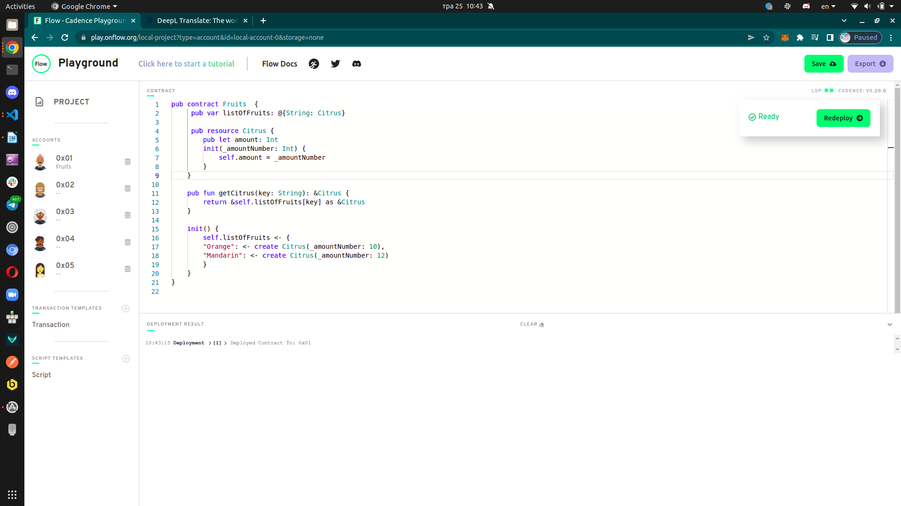
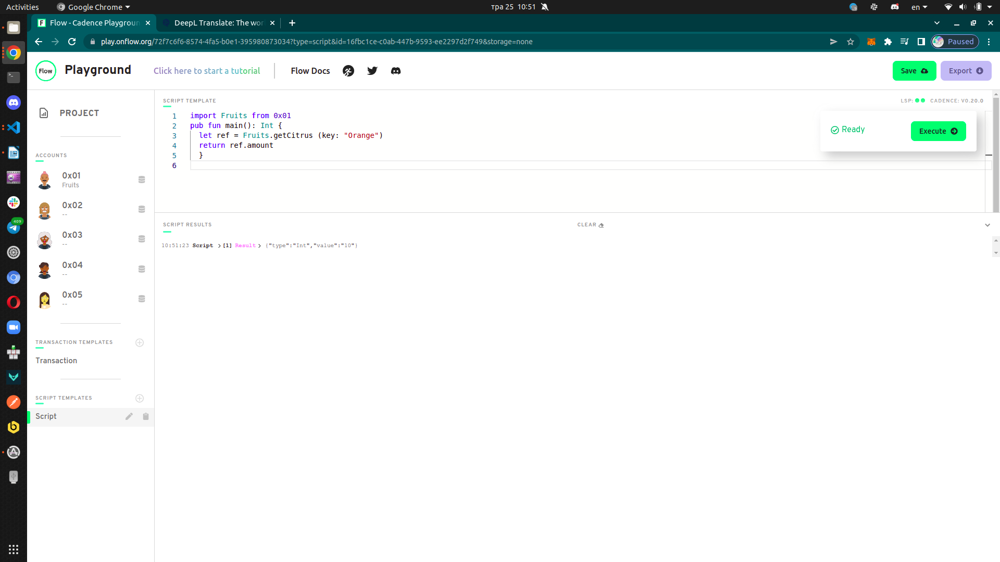
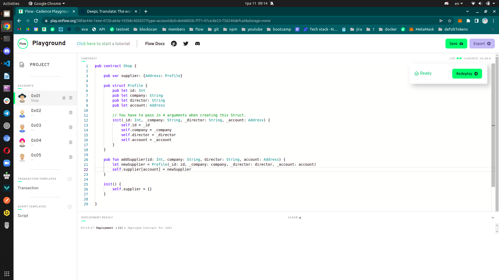
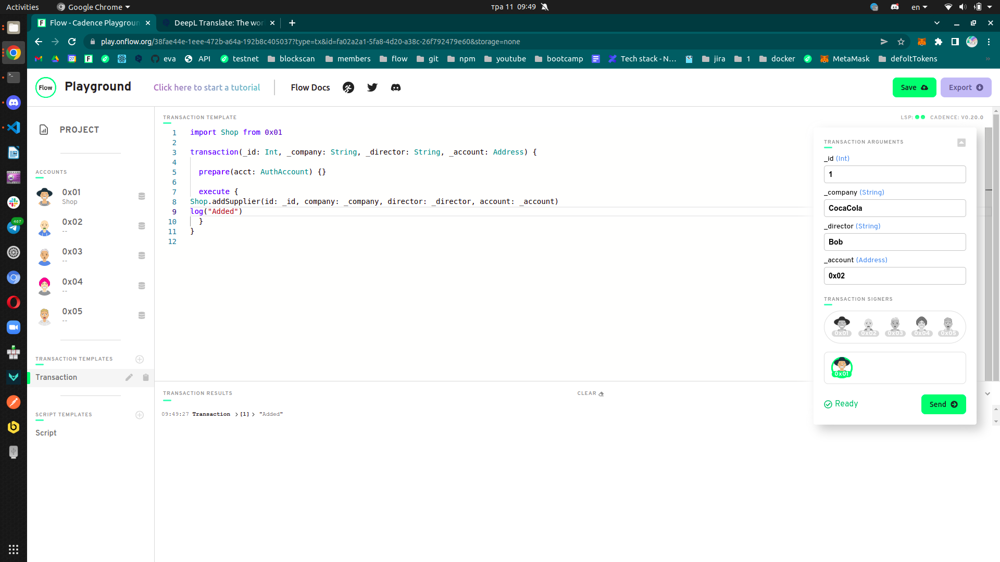
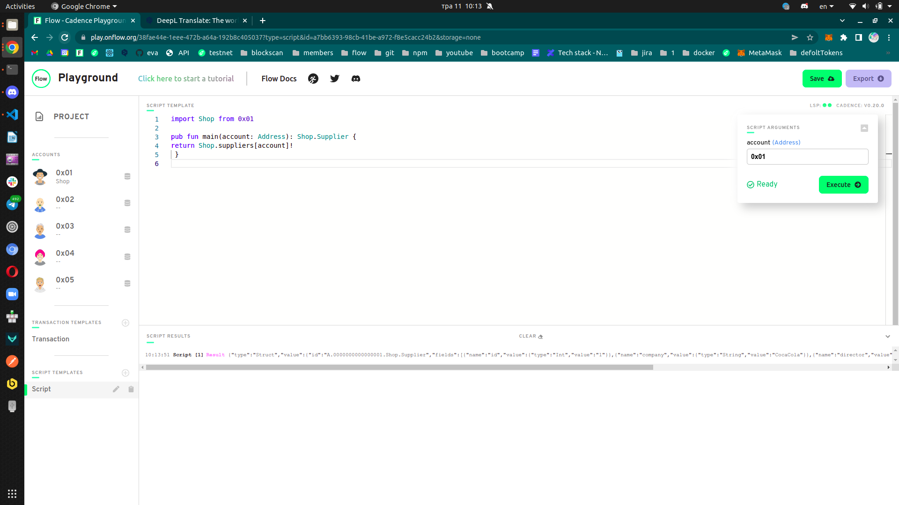

## Table of Contents
- [Chapter 3 Day 1](#Chapter-3-Day-1)
- [Chapter 3 Day 2](#Chapter-3-Day-2)
- [Chapter 3 Day 3](#Chapter-3-Day-3)
- [Chapter 3 Day 4](#Chapter-3-Day-4)
- [Chapter 3 Day 5](#Chapter-3-Day-5)

## Chapter 3 Day 1
Quests
1. In words, list 3 reasons why structs are different from resources.
2. Describe a situation where a resource might be better to use than a struct.
3. What is the keyword to make a new resource?
4. Can a resource be created in a script or transaction (assuming there isn't a public function to create one)?
5. What is the type of the resource below?
6. Let's play the "I Spy" game from when we were kids. I Spy 4 things wrong with this code. Please fix them.

Answer
1. Struct can be declared out of contract. Struct can be easily loosed or overwritten. Struct possible to copy. 
2. Secure creation and activities with NFT.
3. Create
4. Resurce can be created only in contract. 
5. That is resource
```bash
pub contract Test {

    // Hint: There's nothing wrong here ;)
    pub resource Jacob {
        pub let rocks: Bool
        init() {
            self.rocks = true
        }
    }

    pub fun createJacob(): @Jacob { // @Jacob
        let myJacob <- @Jacob() // 1) <- ; 2) @Jacob 
        return <- myJacob // <- 
    }
}

```
<br>


## Chapter 3 Day 2
Quests
1. Write your own smart contract that contains two state variables: an array of resources, and a dictionary of resources. Add functions to remove and add to each of them. They must be different from the examples above.


Answer
1. 
Dictionary Contract <br>

```bash
pub contract Fruits  {

    // dictionary 
    pub var listOfFruits: @{String: Citrus}

    pub resource Citrus {
        pub let message: String
        init() {
            self.message = "Orange"
        }
    }

    // add to dictionary
    pub fun addCitrus(citrus: @Citrus) {
       // let key = citrus.message
       // self.listOfFruits[key] <-! citrus
       // or 
        
        let key = citrus.message
        let oldList <- self.listOfFruits[key] <- citrus
        destroy oldList
    }
    
    //remove from dictionary 
    pub fun removeGreeting(key: String): @Citrus {
        let citrus <- self.listOfFruits.remove(key: key) ?? panic("No Citrus")
        return <- citrus
    }

    init() {
        self.listOfFruits <- {}
    }
}
```
Array Contract <br>
 
```bash
pub contract color {

// array 

    pub var rainbows: @[Color]

    pub resource Color {
        pub let message: String
        init() {
            self.message = "Green"
        }
    }

    pub fun addColor(color: @Color) {
        self.rainbows.append(<- color)
    }

    pub fun removeGreeting(index: Int): @Color {
        return <- self.rainbows.remove(at: index)
    }

    init() {
        self.rainbows <- []
    }

}
```

## Chapter 3 Day 3
Quests
1. Define your own contract that stores a dictionary of resources. Add a function to get a reference to one of the resources in the dictionary.
2. Create a script that reads information from that resource using the reference from the function you defined in part 1.
3. Explain, in your own words, why references can be useful in Cadence.

Answer
1. Reference

2. Script

3. It is easiest way work with resources. So you don`t need move them and know where they are located.


## Chapter 3 Day 4
Quests
1. Deploy a new contract that has a Struct of your choosing inside of it (must be different than Profile).
2. Create a dictionary or array that contains the Struct you defined.
3. Create a function to add to that array/dictionary.
4. Add a transaction to call that function in step 3.
5. Add a script to read the Struct you defined.

Answer
1. Deploy

2. Dictionary
```bash
    pub var supplier: {Address: Profile}
```
3. New function

```bash
    pub fun addSupplier(id: Int, company: String, director: String, account: Address) {
        let newSupplier = Profile(_id: id, _company: company, _director: director, _account: account)
        self.supplier[account] = newSupplier
    }
```
4. Transaction to call

5. Add a script


## Chapter 3 Day 5
Quests
1. Deploy a new contract that has a Struct of your choosing inside of it (must be different than Profile).
2. Create a dictionary or array that contains the Struct you defined.
3. Create a function to add to that array/dictionary.
4. Add a transaction to call that function in step 3.
5. Add a script to read the Struct you defined.

Answer
1. Deploy

2. Dictionary
```bash
    pub var supplier: {Address: Profile}
```
3. New function

```bash
    pub fun addSupplier(id: Int, company: String, director: String, account: Address) {
        let newSupplier = Profile(_id: id, _company: company, _director: director, _account: account)
        self.supplier[account] = newSupplier
    }
```
4. Transaction to call

5. Add a script


