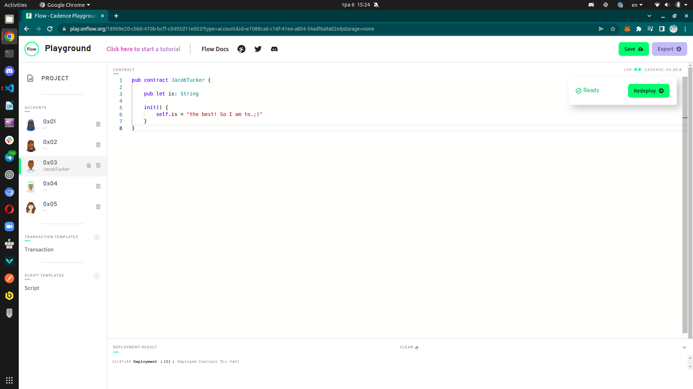
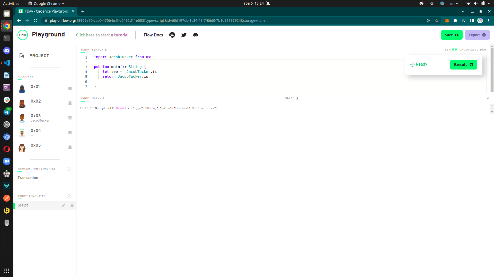

## Table of Contents
- [Chapter 1 Day 1](#Chapter-1-Day-1)
- [Chapter 1 Day 2](#Chapter-1-Day-2)
- [Chapter 2 Day 1](#Chapter-2-Day-1)

## Chapter 1 Day 1

Quests
1. Explain what the Blockchain is in your own words. You can read this to help you, but you don't have to: https://www.investopedia.com/terms/b/blockchain.asp
2. Explain what a Smart Contract is. You can read this to help you, but you don't have to: https://www.ibm.com/topics/smart-contracts
3. Explain the difference between a script and a transaction.

Answer

1. Blockchain it is technology to keep a data in public ledger. Each data collected in block. Next block includes a hash of the previous block.
2. Smart Contract computer program stored on blockchain. Smart Contract very reminiscent real life contract the only difference is that they are completely digital. Code is law & Law is code.
3. Transaction:
   - Change data on Blockchain
   - Cost transaction fees
     Scripts
   - Read data from blockchain
   
   
   
## Chapter 1 Day 2

Quests
1. What are the 5 Cadence Programming Language Pillars?
2. In your opinion, even without knowing anything about the Blockchain or coding, why could the 5 Pillars be useful (you don't have to answer this for #5)?

Answer
1. Safety and Security, Clarity, Approachability, Developer Experience, Resource Oriented Programming.
2. Blockchains are often forced to make trade-offs that prevent them from achieving all 3 aspects:

   - Decentralized: creating a blockchain system that does not rely on a central point of control.
   - Scalable: the ability for a blockchain system to handle an increasingly growing amount of transactions.
   - Secure: the ability of the blockchain system to operate as expected, defend itself from attacks, bugs, and other unforeseen issues.

All Cadence Programming Language Pillars help to improve and advance that 3 aspects in other way, and it is also good, didn`t it?

## Chapter 2 Day 1
Deploy  

Read data 

